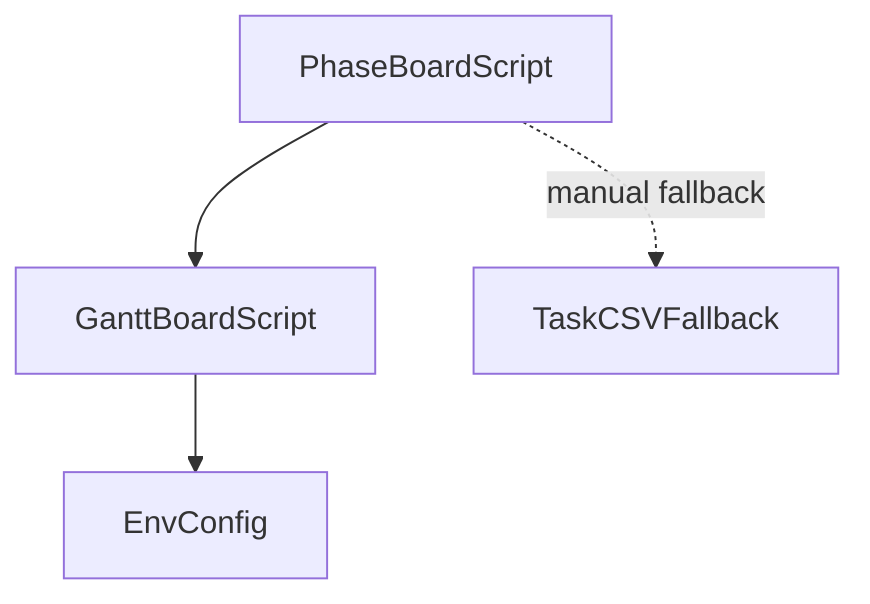

## 1. Stack
- Python 3, **stdlib only** — "no `pip install` needed" (README.md:5).
- No manifest file present (no package.json/pyproject.toml/go.mod/Cargo.toml at repo root or one level down).
- Talks to the Trello REST API (credentials-based); no other frameworks documented.
- `.env`-based config, parsed by a custom `load_env()` (README.md:57).

## 2. Directory map
| path | what lives there |
|---|---|
| `trello_phase_board.py` | Main script — builds the 6-list phase board (labels, checklists, Gantt due dates) (README.md:34) |
| `trello_gantt_board.py` | First-generation script (3-list Gantt mirror board); also holds shared API helpers + `.env` loader imported by the phase script (README.md:35, 57) |
| `sre_tasks_trello.csv` | Manual fallback: same 28 tasks flattened for Trello's CSV import (README.md:36) |
| `.env` | Trello credentials — TRELLO_KEY / TRELLO_SECRET / TRELLO_TOKEN. Git-ignored (README.md:37, 51-55) |
| `__pycache__/` | Compiled bytecode, build artifact |

## 3. Diagram

## 4. Component index
- [[PhaseBoardScript]]
- [[GanttBoardScript]]
- [[EnvConfig]]
- [[TaskCSVFallback]]

## 5. Entry points
- **Main / prod:** `python3 trello_phase_board.py` (README.md:72) — creates the phase board.
  - Dry run (no API calls): `python3 trello_phase_board.py --dry-run` (README.md:66)
  - Override board name: `python3 trello_phase_board.py --name "My Board Name"` (README.md:78)
- **Legacy:** `trello_gantt_board.py` — first-generation Gantt-mirror board script; also supplies shared API helpers/`load_env()` imported by the phase script (README.md:35). No separate CLI usage documented in README.

## 6. Conventions
- `.env` format is `KEY = value`; `load_env()` tolerates spaces around `=`, and real exported env vars take precedence over the file (README.md:57-59).
- Scripts are **create-only** — re-running builds a second board; no idempotency check, no update mode (README.md:81-82).
- `--dry-run` prints the full plan and makes zero API calls before any real run (README.md:63-66).
- `sre_tasks_trello.csv` is a hand-maintained parallel copy — editing the task table in a script does **not** regenerate it (README.md:40-41).
- `.gitignore` keeps `.env`, `__pycache__/`, and editor noise out of version control (README.md:38).

## 7. Where things go
- **Add/change a task/card:** edit the task table in `trello_phase_board.py`, then hand-update `sre_tasks_trello.csv` to match (it does not regenerate) (README.md:40-41).
- **Add/change a label:** touch `trello_phase_board.py` (labels are part of the phase board build) (README.md:107-116).
- **Enable member auto-assignment:** fill in real Trello usernames in `USERNAMES` — currently empty in both scripts (README.md:158-159).
- **Rotate/change Trello credentials:** edit `.env` (`TRELLO_KEY`, `TRELLO_SECRET`, `TRELLO_TOKEN`) (README.md:51-55).
- **Update a card after creation:** no code path exists — edit by hand in Trello, or write a one-off `PUT /cards/{id}` call (README.md:165-166).
